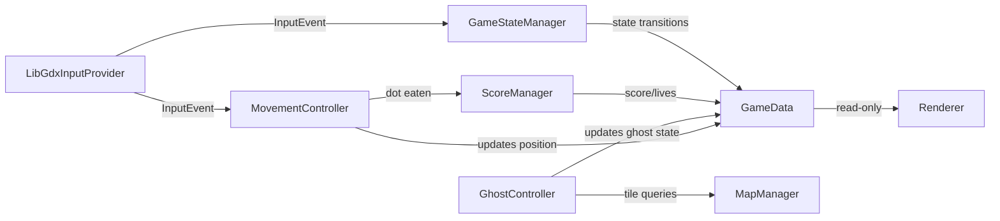

# PAC-MAN — Java/LibGDX with MVC Architecture

A fully playable Pac-Man game written in Java using LibGDX, structured around a strict **MVC (Model-View-Controller)** architecture with clean separation of concerns across all three layers.

---

## How to Run

1. Download `PacmanGame-Windows.zip`
2. Right-click the zip → **Extract All** → Extract
3. Open the extracted `PacmanGame` folder
4. Double-click **`PacmanGame.exe`** — the game launches immediately

No Java needed. No installation. No setup required.

---

## Controls

| Key | Action |
|---|---|
| `Arrow Keys` | Move Pac-Man |
| `Space` | Start game / Restart after Game Over |

---

## Gameplay

- Eat all dots to complete the level
- Eat a power pellet to frighten ghosts
- Eat a frightened ghost for bonus points
- Avoid ghosts or lose a life
- 3 lives per game
- Fruit appears halfway through each level

### Scoring

| Action | Points |
|---|---|
| Dot | 10 |
| Power Pellet | 50 |
| Ghost (1st) | 200 |
| Ghost (2nd) | 400 |
| Ghost (3rd) | 800 |
| Ghost (4th) | 1600 |
| Fruit | 100–5000 (level dependent) |

---

## Project Structure

```
com/pacman/
  ├── model/       ← Game data, rules, AI strategies, interfaces
  ├── view/        ← All rendering and sound
  └── controller/  ← Game logic, input, state machine
```

---

## MVC Architecture

This project enforces a strict three-layer MVC separation. Each layer has one clearly defined responsibility and no layer crosses into another's domain.

### Model — Game State & Rules

The Model owns all game data and rules. Nothing in the Model knows about rendering or input.

| File | Purpose |
|---|---|
| `GameData` | Central game state — score, lives, level, maze |
| `GhostData` | Per-ghost state — mode, position, behavior |
| `Entity` | Position data, implements `Movable`, `Renderable`, `Collidable` |
| `MapManager` | Maze layout, position resets, tile queries |
| `ScoreManager` | All scoring and high-score logic |
| `GhostBehavior` | Abstract base for ghost AI strategies |
| `BlinkyBehavior` | Blinky targets Pac-Man's exact tile |
| `PinkyBehavior` | Pinky targets 4 tiles ahead of Pac-Man |
| `InkyBehavior` | Inky uses a vector calculation via Blinky's position |
| `ClydeBehavior` | Clyde chases when far, retreats when close |
| `SoundPlayer` | Audio interface — decouples game logic from LibGDX |
| `InputProvider` | Input interface — decouples movement from LibGDX |
| `Movable` | Interface for movement contract |
| `Renderable` | Interface for draw-position contract |
| `Collidable` | Interface for collision contract |

### View — Rendering & Sound

The View handles all rendering and audio. It reads from the Model but **never modifies it**.

| File | Purpose |
|---|---|
| `Renderer` | Orchestrates the full render pipeline |
| `MazeRenderer` | Draws maze tiles, dots, power pellets |
| `GhostRenderer` | Draws ghost sprites and frightened state |
| `PacmanRenderer` | Draws Pac-Man with mouth animation |
| `HudRenderer` | Draws score, lives, overlays, fruit |
| `ColourHelper` | Pure colour calculation utility |
| `ResourceManager` | Loads and unloads all sounds and textures |
| `LibGdxSoundPlayer` | Concrete LibGDX implementation of `SoundPlayer` |
| `LibGdxInputProvider` | Concrete LibGDX implementation of `InputProvider` |

### Controller — Game Logic & Flow

The Controller drives the game loop. It receives input, updates the Model, and triggers the View.

| File | Purpose |
|---|---|
| `Main` | Entry point and composition root — wires all dependencies |
| `GameStateManager` | State machine — INTRO, READY, PLAYING, DEATH, GAME OVER |
| `GameInitializer` | Sets up a fresh game session |
| `MovementController` | Handles Pac-Man movement and tile alignment |
| `GhostController` | Handles ghost movement, mode timers, pathfinding |
| `DotConsumer` | Detects and processes dot and power pellet eating |
| `FruitManager` | Handles fruit spawn, timer, and eat detection |
| `GhostCollisionHandler` | Resolves Pac-Man vs ghost collisions |
| `CollisionDetector` | Generic overlap detection using `Collidable` |

---

## MVC Interaction Diagram

```
Player Input
     │
     ▼
LibGdxInputProvider
     │
     ▼
Controller (MovementController, GhostController, GameStateManager)
     │
     ▼
Model updates (GameData, ScoreManager, MapManager)
     │
     ▼
View reads Model and renders (Renderer → sub-renderers)
     │
     ▼
Screen
```

## MVC Interaction Diagram



---

## MVC Flow — Step by Step

1. The player presses an arrow key
2. `LibGdxInputProvider` captures the key and passes it to the Controller
3. `MovementController` updates Pac-Man's position in `GameData`
4. `DotConsumer` checks if a dot was eaten and calls `ScoreManager`
5. `GhostCollisionHandler` checks for ghost contact
6. `GameStateManager` transitions states as needed (e.g. PLAYING → DEATH)
7. `Renderer` reads the updated `GameData` and draws the current frame

---

## Layer Responsibilities Summary

| Layer | Owns | Never touches |
|---|---|---|
| **Model** | Game state, rules, AI logic, interfaces | Rendering, input handling |
| **View** | Rendering pipeline, sound playback | Game rules, state mutation |
| **Controller** | Game flow, input dispatch, collision resolution | Direct rendering calls |

---

## Ghost Personalities

| Ghost | Colour | Behaviour |
|---|---|---|
| Blinky | Red | Directly chases Pac-Man |
| Pinky | Pink | Targets 4 tiles ahead of Pac-Man |
| Inky | Cyan | Vector-based targeting using Blinky's position |
| Clyde | Orange | Chases when far, retreats to corner when close |

---

## Assets Required

Place these files in the `assets/` folder:

```
chomp1.wav
chomp2.wav
death.wav
eat_fruit.wav
eat_ghost.wav
ghost_running_away.wav
ghost_turn_blue.wav
high_score.wav
Intro.wav
power_siren.wav
PressStart2P-Regular.ttf
spritesheet.png
```
