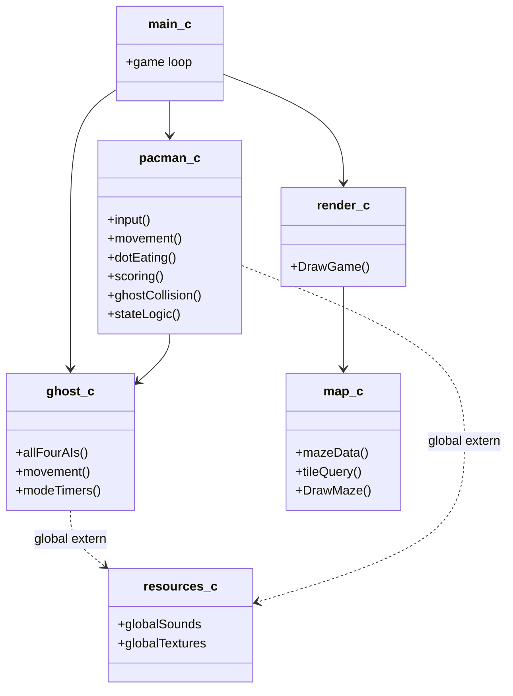
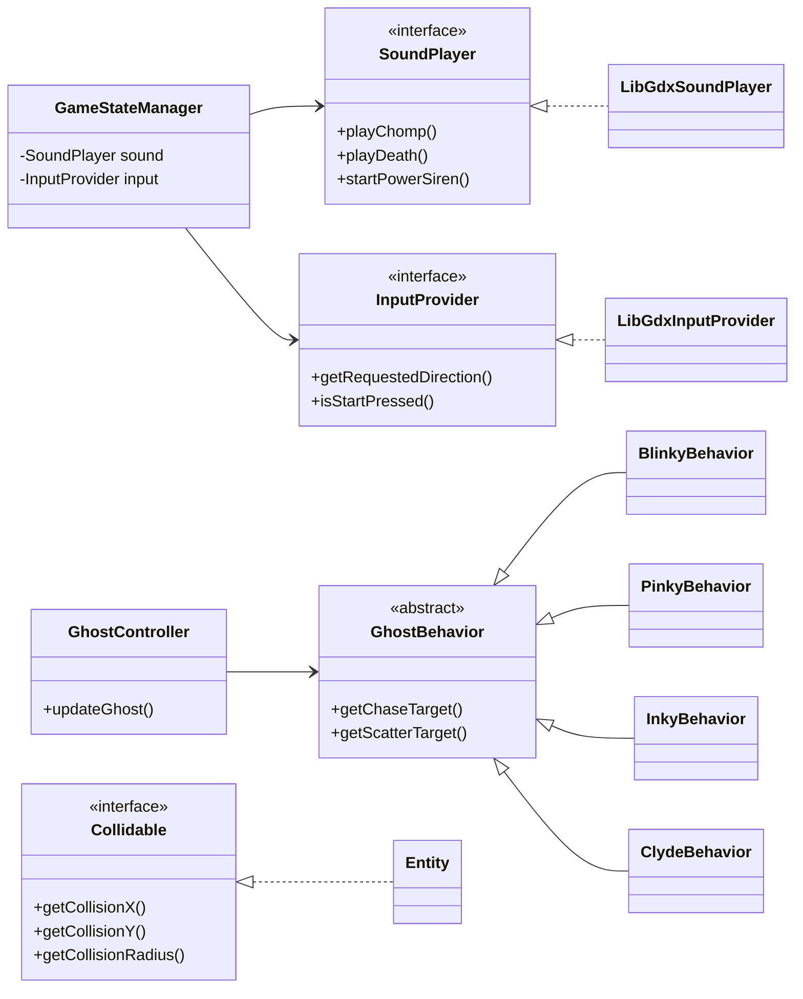
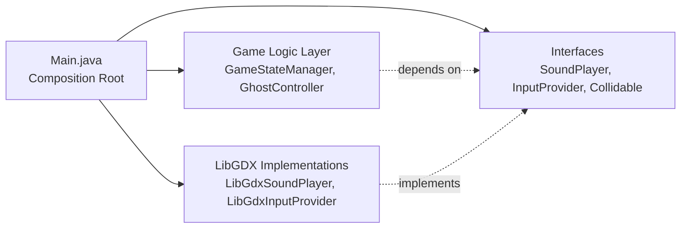
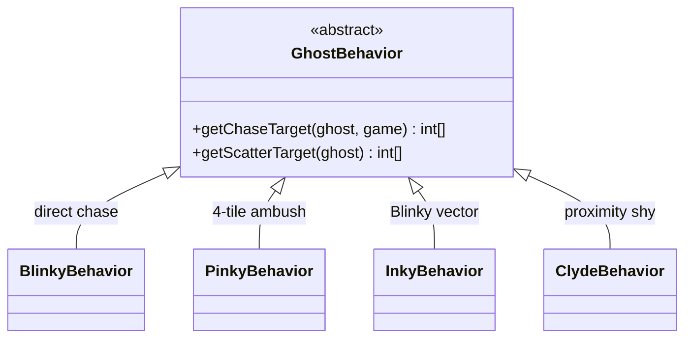

# Pac-Man: SOLID OOD Refactoring Documentation

### Refactoring a C (Raylib) Project into a Java (LibGDX) SOLID OOD Model

---

## Table of Contents

1. [Project Summary](#1-project-summary)
2. [Folder Structure](#2-folder-structure)
3. [Technology Migration: C + Raylib → Java + LibGDX](#3-technology-migration-c--raylib--java--libgdx)
4. [UML Diagrams](#4-uml-diagrams)
5. [SOLID Principles Applied](#5-solid-principles-applied)
6. [Design Patterns Used](#6-design-patterns-used)
7. [AI Prompt Set for Execution](#7-ai-prompt-set-for-execution)
8. [Conclusion](#8-conclusion)

---

## 1. Project Summary

| Property | C + Raylib (original) | Java + LibGDX (refactored) |
|---|---|---|
| Language | C (procedural) | Java (object-oriented) |
| Framework | Raylib | LibGDX |
| Source files | 8 `.c/.h` pairs | 38 `.java` files across 9 packages |
| Interfaces | None | 5 (`Movable`, `Renderable`, `Collidable`, `SoundPlayer`, `InputProvider`) |
| Inheritance | None | `GhostBehavior` abstract class + 4 concrete subclasses |
| Global state | `extern Game game` — one struct accessed by every file | `GameData` singleton, injected via constructors |
| Largest file | `pacman.c` — 273 lines, 8+ responsibilities | No file exceeds 150 lines, each has 1 responsibility |
| Design patterns | None | Strategy, Singleton, Composition Root |

---

## 2. Folder Structure

### GitHub Repository Layout

```
0714-02-CSE-2100/
  assets/          ← audio and sprite assets (shared)
  core/            ← all game source code (platform-independent)
    src/main/java/com/pacman/
      types/       ← enums, interfaces, data classes
      audio/       ← SoundPlayer interface + LibGDX implementation
      input/       ← InputProvider interface + LibGDX implementation
      scoring/     ← ScoreManager
      map/         ← MapManager
      pacman/      ← movement, dot eating, collision, fruit
      ghost/       ← GhostBehavior (abstract) + 4 AI subclasses
      render/      ← all rendering classes
      game/        ← Main, GameStateManager, GameInitializer
  lwjgl3/          ← desktop launcher (platform-specific entry point)
  LICENSE
```

### C Project — flat, mixed responsibilities

```
Pacman-modular/
  types.h          ← ALL enums, ALL structs, global Game extern
  main.c           ← game loop
  pacman.c / .h    ← input + movement + dot eating + scoring +
                      collision + fruit + state machine (273 lines)
  ghost.c / .h     ← all 4 ghost AIs + movement + mode timers (252 lines)
  map.c / .h       ← maze data + resets + tile queries + DrawMaze() (162 lines)
  render.c / .h    ← ghosts, Pac-Man, HUD, fruit all in one function (216 lines)
  resources.c / .h ← 9 global sound/texture variables, load/unload
```

Every `.c` file accesses `game` via `extern Game game` — no ownership, no restriction.

---

## 3. Technology Migration: C + Raylib → Java + LibGDX

C is a procedural language. Every feature SOLID depends on — interfaces, polymorphism, access control, dependency injection — does not exist as a language construct in C.

| SOLID Requirement | What C offers | What Java offers |
|---|---|---|
| Abstraction (ISP, DIP) | Function pointers — no compiler check | `interface` — compiler-enforced contract |
| Polymorphism (OCP, LSP) | `switch` on enum — modify existing code to extend | `abstract class` + subclasses — extend without modifying |
| Encapsulation (SRP) | `static` in `.c` files — no access control | `private` fields — enforced by compiler |
| Dependency injection (DIP) | Pointer parameters — convention only | Constructor injection — explicit and traceable |

**Raylib** exposes global C functions (`PlaySound()`, `IsKeyDown()`). These cannot be wrapped behind an interface, so game logic is permanently coupled to the platform.

**LibGDX** wraps all platform access behind Java objects (`Gdx.audio`, `Gdx.input`). These can be hidden behind interfaces and injected — exactly what DIP requires.

**Practical result:** Swapping LibGDX for another Java framework requires changing only two files (`LibGdxSoundPlayer` and `LibGdxInputProvider`). Zero changes to any game logic.

---

## 4. UML Diagrams

### Diagram 1 — Before (C procedural, flat dependencies)



### Diagram 2 — After (Java + LibGDX, SOLID boundaries)



### Diagram 3 — Dependency flow (Composition Root)



> **Key point:** `Main.java` is the only file that knows about LibGDX concrete types. All game logic depends on the interfaces in the middle column — making the game framework-independent.

---

## 5. SOLID Principles Applied

---

### S — Single Responsibility Principle

> *A class should have only one reason to change.*

#### Violation in C

`pacman.c` (273 lines) handles input, movement, dot eating, scoring, power pellets, fruit, ghost collision, and the state machine — all in one function.

```c
// pacman.c — 8 responsibilities in UpdatePacman()
void UpdatePacman(void) {
    // Input
    if (IsKeyDown(KEY_UP)) game.pacman.nextDirection = DIR_UP;

    // Movement
    if (game.pacman.direction == DIR_LEFT) game.pacman.x -= game.pacman.speed;

    // Dot eating + Scoring
    if (game.maze[game.pacman.tileY][game.pacman.tileX] == 2) {
        game.score += 10;
        game.dotsEaten++;
        PlaySound(soundChomp);
    }

    // Ghost collision
    for (int i = 0; i < GHOST_COUNT; i++) { /* ... eat or die */ }
}
```

`map.c` mixed tile logic with `DrawMaze()`. `render.c` drew ghosts, Pac-Man, HUD, and fruit all inside a single `DrawGame()` function.

#### Fix in Java

Each concern is its own class. `Renderer.java` only orchestrates — it draws nothing itself.

```java
// Renderer.java — orchestrates only, draws nothing
public void drawGame() {
    sr.begin(ShapeType.Filled);
    mazeRenderer.draw(game);
    ghostRenderer.draw(game);
    pacmanRenderer.draw(game);
    sr.end();
    batch.begin();
    hudRenderer.drawText(game);
    batch.end();
}

// ScoreManager.java — scoring only
public void awardDot()        { addPoints(10); }
public void awardGhostEaten() { addPoints(ghostPoints[game.ghostsEaten]); }
```

**Before vs After — responsibility count:**

| C File | Responsibilities | Java Replacement |
|---|:---:|---|
| `pacman.c` (273 lines) | 8 | `MovementController`, `DotConsumer`, `FruitManager`, `GhostCollisionHandler`, `ScoreManager` |
| `ghost.c` (252 lines) | 5 | `GhostController`, `BlinkyBehavior`, `PinkyBehavior`, `InkyBehavior`, `ClydeBehavior` |
| `render.c` (216 lines) | 5 | `MazeRenderer`, `GhostRenderer`, `PacmanRenderer`, `HudRenderer`, `ColourHelper` |
| `map.c` (162 lines) | 4 | `MapManager` (rendering removed entirely) |

---

### O — Open/Closed Principle

> *Open for extension, closed for modification.*

#### Violation in C

Adding a 5th ghost requires opening `ghost.c` and inserting another `else if` into the working, tested `UpdateGhost()` function.

```c
// ghost.c — must MODIFY to add any new ghost
if      (ghost->type == GHOST_BLINKY) { targetX = pacman.tileX; }
else if (ghost->type == GHOST_PINKY)  { targetY += 4; }
else if (ghost->type == GHOST_INKY)   { /* vector calc */ }
else if (ghost->type == GHOST_CLYDE)  { /* proximity logic */ }
// A 5th ghost = edit this file = risk breaking existing ghosts
```

#### Fix in Java — Strategy Pattern

Each ghost AI is its own subclass. `GhostController` calls `ghost.behavior.getChaseTarget()` — it never checks a type.

```java
// GhostBehavior.java — abstract base, OPEN for extension
public abstract class GhostBehavior {
    public abstract int[] getChaseTarget(GhostData ghost, GameData game);
}

// BlinkyBehavior.java — self-contained, GhostController never touched
public class BlinkyBehavior extends GhostBehavior {
    @Override
    public int[] getChaseTarget(GhostData ghost, GameData game) {
        return new int[]{ game.pacman.tileX, game.pacman.tileY };
    }
}
```

Adding a 5th ghost = create one new file. `GhostController` is never opened.

---

### L — Liskov Substitution Principle

> *Subtypes must be substitutable for their base type without breaking correctness.*

#### Violation in C

`Entity` is a plain struct with no parent type. Every collision check must know the exact concrete type — no reuse is possible.

```c
// C — every new entity type needs a separate collision function
float dist = sqrtf(powf(game.pacman.x - game.ghosts[i].entity.x, 2) +
                   powf(game.pacman.y - game.ghosts[i].entity.y, 2));
// Cannot generalise — no shared type between pacman and ghost
```

#### Fix in Java

`Entity` implements `Collidable`. Any object honouring that contract works in `GhostCollisionHandler` without changes.

```java
// GhostCollisionHandler.java — works against Collidable, not Entity directly
Collidable pac   = game.pacman.entity;
Collidable ghost = g.entity;

float dx   = pac.getCollisionX() - ghost.getCollisionX();
float dist = (float) Math.sqrt(dx * dx + dy * dy);
// Substituting any Collidable here produces correct results
```

The `GhostBehavior` hierarchy also demonstrates LSP — `GhostController` calls `getChaseTarget()` on any of the four subclasses and always gets a valid `int[2]` tile back.

---

### I — Interface Segregation Principle

> *Clients should not be forced to depend on interfaces they do not use.*

#### Violation in C

Every `.c` file includes all of `raylib.h` (400+ functions) just to call one or two of them.

```c
// ghost.c — includes entire Raylib just to call IsSoundPlaying + PlaySound
#include "raylib.h"
if (!IsSoundPlaying(soundPowerSiren)) PlaySound(soundPowerSiren);
```

#### Fix in Java — five focused interfaces

```java
// InputProvider.java — 2 methods, only movement and state logic use this
public interface InputProvider {
    Direction getRequestedDirection();
    boolean   isStartPressed();
}

// Collidable.java — 3 methods, only collision detection uses this
public interface Collidable {
    float getCollisionX();
    float getCollisionY();
    float getCollisionRadius();
}

// SoundPlayer.java — audio contract, only game logic uses this
public interface SoundPlayer {
    void playChomp();   void playDeath();   void playEatGhost();
    void playIntro();   void stopIntro();   boolean isIntroPlaying();
    void startPowerSiren(); void stopPowerSiren(); boolean isPowerSirenPlaying();
}
```

Each consumer depends only on what it actually calls — `MovementController` sees only `getRequestedDirection()`, never audio or rendering.

---

### D — Dependency Inversion Principle

> *High-level modules should not depend on low-level modules. Both should depend on abstractions.*

#### Violation in C

Game rules call Raylib APIs directly. `ghost.c` reads the global `game` struct by name — a hidden, uninjected dependency.

```c
// pacman.c — business logic directly calls platform API
PlaySound(soundChomp);
if (!IsSoundPlaying(soundIntro)) { /* state logic */ }

// ghost.c — reaches into global state with no injection
int dx = ghost->entity.tileX - game.pacman.tileX; // 'game' is a global extern
```

#### Fix in Java — Composition Root

`Main.java` is the only file that knows about LibGDX concrete types. Everything else receives dependencies via constructors.

```java
// Main.java — ONLY place concrete types are constructed (Composition Root)
SoundPlayer   sound = new LibGdxSoundPlayer(rm);
InputProvider input = new LibGdxInputProvider();

// All game logic classes receive abstractions — zero LibGDX imports inside them
stateManager = new GameStateManager(sound, input, movement, dots, fruit, collision);
```

```java
// GameStateManager.java — depends on SoundPlayer, never LibGDX
public class GameStateManager {
    private final SoundPlayer   sound;   // abstraction injected
    private final InputProvider input;   // abstraction injected
    // No LibGDX import in this file
}
```

MapManager also demonstrates DIP — the original C `IsWall()` pulled from the global `game` silently. The Java version makes the dependency explicit:

```java
// Before (C): game.maze is a hidden global dependency
// After (Java): dependency is passed in — visible and traceable
public static boolean isWall(int x, int y, GameData game) {
    return (game.maze[y][x] == 1);
}
```

---

## 7. Design Patterns Used

| Pattern | Where Applied | Purpose |
|---|---|---|
| **Strategy** | `GhostBehavior` + 4 subclasses | Each ghost AI in its own class — enables OCP |
| **Singleton** | `GameData`, `ResourceManager` | Single controlled instance of game state and assets |
| **Composition Root** | `Main.java` | Only place concrete types are wired — enforces DIP |
| **Template Method** | `GhostBehavior.getScatterTarget()` | Default scatter behaviour that subclasses can override |

---

## 7. AI Prompt used for Execution

The prompts below were used to guide the step-by-step refactoring from the C codebase to the Java SOLID design. Each prompt targeted a specific problem and produced a concrete, verifiable output.

---

## Prompt 1 — Responsibility Audit
*"Go through every C file in this Pac-Man project. For each file, count how many different things it is responsible for and list them and then tell me which ones are the most urgent to split apart and why."*

| File | Responsibilities Found | Priority |
|---|---|---|
| `pacman.c` | Input, movement, dot eating, scoring, power pellets, fruit, ghost collision, state machine | Highest — 8 jobs in 273 lines |
| `ghost.c` | All 4 ghost AIs, movement, mode timers, siren sound | High — 5 jobs in 252 lines |
| `render.c` | Ghost drawing, Pac-Man drawing, HUD, fruit, colour helpers | High — 5 jobs in 216 lines |
| `map.c` | Maze data, position resets, tile queries, `DrawMaze()` | Medium — rendering inside logic file |
| `resources.c` | Load and unload for 9 global sound/texture variables | Low — manageable but unencapsulated |

---

## Prompt 2 — Global State Elimination
*"The C project uses `extern Game game` so suggest a Java equivalent that gives controlled, single-point access to game state without exposing it as a raw global."*

**Output:** `GameData` singleton with a private constructor. No other class can create or destroy the game state. `GameData.getInstance()` is the only access point. A `reset()` method allows clean restarts without leftover state.

```java
// Before (C): any file could write game.score = 0 at any time
extern Game game;

// After (Java): controlled access through one entry point
public class GameData {
    private static GameData instance;
    private GameData() { /* only GameData constructs itself */ }
    public static GameData getInstance() {
        if (instance == null) instance = new GameData();
        return instance;
    }
}
```

---

## Prompt 3 — Interface Design for Platform Isolation
*"The game logic in `pacman.c` and `ghost.c` calls Raylib functions like `PlaySound()` and `IsKeyDown()` directly. Design a set of Java interfaces that would let us swap the audio and input framework without touching any game logic."*

**Output:** Two boundary interfaces placed between game logic and LibGDX:

| Interface | Methods | Who implements it | Who uses it |
|---|---|---|---|
| `SoundPlayer` | `playChomp()`, `playDeath()`, `startPowerSiren()`, etc. | `LibGdxSoundPlayer` | `DotConsumer`, `GhostCollisionHandler`, `GameStateManager` |
| `InputProvider` | `getRequestedDirection()`, `isStartPressed()` | `LibGdxInputProvider` | `MovementController`, `GameStateManager` |

Game logic imports only the interface. LibGDX never appears outside `Main.java`.

---

## Prompt 4 — Ghost AI Restructure
*"In `ghost.c` all four ghost personalities Blinky, Pinky, Inky, Clyde are handled inside one big `if/else if` block. Every time we want to change one ghost we risk breaking the others. Redesign this so each ghost's AI is isolated and adding a new ghost requires zero changes to existing code."*

**Output:** Strategy Pattern — one abstract base, four subclasses.



`GhostController` calls `ghost.behavior.getChaseTarget()` — it never checks which ghost type it is. A new ghost = one new file, nothing else changes.

---

## Prompt 5 — Rendering Separation
*"`map.c` contains `DrawMaze()` alongside tile collision logic. `render.c` draws ghosts, Pac-Man, the HUD, and fruit all inside a single `DrawGame()` function. Split the rendering layer so each visual concern is its own class and the orchestrator draws nothing itself."*

**Output:**

| New Class | Draws |
|---|---|
| `MazeRenderer` | Walls, dots, power pellets |
| `GhostRenderer` | Ghost sprites, frightened state, eyes-only eaten state |
| `PacmanRenderer` | Pac-Man arc animation, death flicker |
| `HudRenderer` | Score, level, lives icons, state overlays |
| `ColourHelper` | Pure colour calculation — no drawing |
| `Renderer` | Calls the above in order — draws nothing itself |

---

## Prompt 6 — Dependency Wiring Verification
*"Show me how `Main.java` should be structured as the composition root. It should be the only file that constructs LibGDX objects. Everything else should receive what it needs through its constructor. List every injection point."*

**Output:** All injections visible in one place.

```java
// Main.java — every dependency constructed and wired here
SoundPlayer   sound    = new LibGdxSoundPlayer(rm);
InputProvider input    = new LibGdxInputProvider();
ScoreManager  scorer   = new ScoreManager(game, sound);
MovementController mv  = new MovementController(input);
DotConsumer   dots     = new DotConsumer(sound, scorer);
FruitManager  fruit    = new FruitManager(sound, scorer);
GhostCollisionHandler gc = new GhostCollisionHandler(sound, scorer);
stateManager = new GameStateManager(sound, input, mv, dots, fruit, gc, map);
// No class below this line ever imports a LibGDX concrete type
```

---

## Prompt 7 — Final SOLID Verification
*"Go through all five SOLID principles and tell me whether each one is properly applied in the refactored Java code. For each principle, point to the specific class or pattern that demonstrates it."*

| Principle | Evidence in Code | Verdict |
|---|---|---|
| **SRP** | `pacman.c` (8 jobs) → 5 dedicated classes. `render.c` (5 jobs) → 5 renderer classes | ✅ Resolved |
| **OCP** | Ghost AI `if/else if` → `GhostBehavior` + 4 subclasses. `GhostController` never modified | ✅ Resolved |
| **LSP** | `Entity` implements `Collidable` — any conforming type works in `GhostCollisionHandler` | ✅ Resolved |
| **ISP** | 5 focused interfaces — each consumer imports only what it calls | ✅ Resolved |
| **DIP** | `Main.java` is the only LibGDX import point — all game logic depends on interfaces | ✅ Resolved |

---

## 8. Conclusion

The original C codebase had structural problems fundamental to the language — a global struct accessed by every file, 273-line functions with 8 mixed responsibilities, and game logic tightly coupled to Raylib platform calls. Moving to Java provided the language constructs to fix every one of these:

- **SRP** — `pacman.c` (8 responsibilities) split into 5 focused classes. `render.c` (5 responsibilities) split into 5 renderer classes.
- **OCP** — The ghost AI `if/else if` chain replaced by 4 subclasses of `GhostBehavior`. `GhostController` is permanently closed for modification.
- **LSP** — `Entity` implements `Collidable`, `Movable`, and `Renderable` — collision and rendering code is correct for any conforming type.
- **ISP** — 5 focused interfaces (`Movable`, `Renderable`, `Collidable`, `SoundPlayer`, `InputProvider`) so every consumer depends only on what it uses.
- **DIP** — `Main.java` as the Composition Root is the only file that imports LibGDX concrete types. All game logic depends on interfaces — the project is framework-independent.
